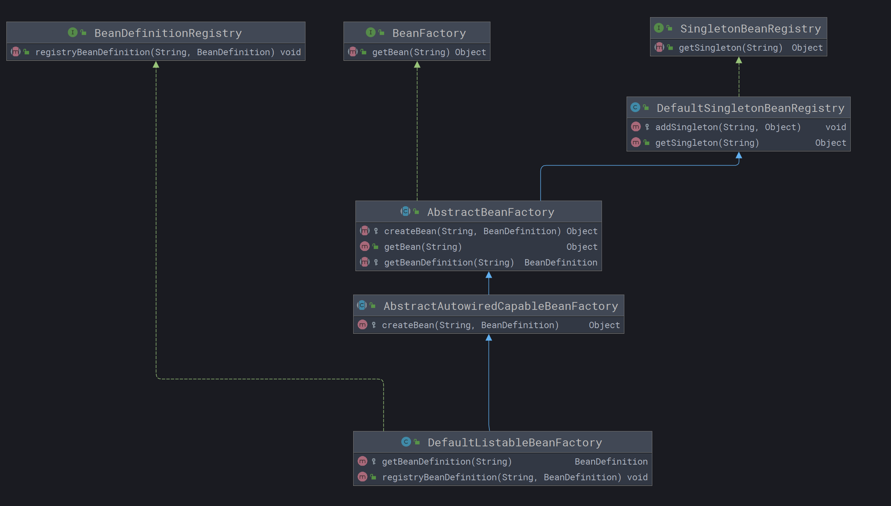
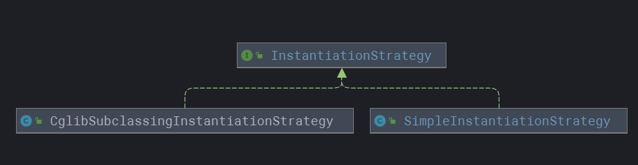

# small-spring

## 介绍

手撸spring核心功能
学习自傅哥[手撸spring教程](https://bugstack.cn/md/spring/develop-spring/2021-05-16-%E7%AC%AC1%E7%AB%A0%EF%BC%9A%E5%BC%80%E7%AF%87%E4%BB%8B%E7%BB%8D%EF%BC%8C%E6%89%8B%E5%86%99Spring%E8%83%BD%E7%BB%99%E4%BD%A0%E5%B8%A6%E6%9D%A5%E4%BB%80%E4%B9%88%EF%BC%9F.html)


## step-01 一个简单的Spring容器

### 主要内容

1. 定义简单的BeanDefinition，暂时不包括singleton、BeanClassName等，只定义一个Object类型用于存放对象
2. 注册，把BeanDefinition存放到HashMap中
3. 获取，bean的名字作为key，容器初始化完成后可以直接获取

### 工程结构

```
small-spring-step-01
 └── src
     ├── main
     │   └── java
     │       └── com
     │           └── cz
     │               └── springframework
     │                   ├── BeanDefinition.java
     │                   └── BeanFactory.java
     └── test
         └── java
             └── com
                 └── cz
                     └── springframework
                         └── test
                             ├── ApiTest.java
                             └── bean
                                 └── UserService.java
```

### 核心代码实现

- BeanDefinition：存放bean的实例化信息
- BeanFactory：bean对象的工厂，可以操作对beanDefinition存放和获取

```java
public class BeanDefinition {

    private Object bean;

    public Object getBean() {
        return bean;
    }

    public void setBean(Object bean) {
        this.bean = bean;
    }
}

public class BeanFactory {

    private Map<String, BeanDefinition> beanDefinitionMap = new ConcurrentHashMap<>();

    /**
     * 获取bean
     */
    public Object getBean(String name) {
        return beanDefinitionMap.get(name).getBean();
    }

    /**
     * 注册bean
     */
    public void registerBeanDefinition(String name, BeanDefinition beanDefinition) {
        beanDefinitionMap.put(name, beanDefinition);
    }
}
```

### 测试类

```java
public class ApiTest {

    @Test
    public void test_BeanFactory() {
        // 1.初始化beanFactory
        BeanFactory beanFactory = new BeanFactory();
        // 2.注册bean
        BeanDefinition beanDefinition = new BeanDefinition();
        beanDefinition.setBean(new UserService());
        beanFactory.registerBeanDefinition("userService", beanDefinition);
        // 3.获取bean
        UserService userService = (UserService) beanFactory.getBean("userService");
        userService.queryUserInfo();
    }
}
```

### 打印结果

> 查询用户信息

## step-02 使用模板模式，实现BeanDefinition、注册、获取

### 主要内容

1. 将上一步的`BeanDefinition`改造，把属性`Object`改为`Class`
2. 在获取bean对象时，先从单例池中去拿，拿不到再自己创建
3. 使用`模板模式`，定义核心方法的执行逻辑

### 实现步骤

1. 将BeanFactory抽象为`AbstractBeanFactory`，使用`模板模式`，定义核心方法的执行逻辑
2. 定义单例bean注册接口，由DefaultSingletonBeanRegistry实现，然后由`AbstractBeanFactory`
   继承，此时AbstractBeanFactory就有了BeanFactory的功能和单例bean注册功能

### 工程结构

```
small-spring-step-02
 └── src
     ├── main
     │   └── java
     │       └── com
     │           └── cz
     │               └── springframework
     │                   └── beans
     │                       ├── BeansException.java
     │                       └── factory
     │                           ├── BeanFactory.java
     │                           ├── config
     │                           │   ├── BeanDefinition.java
     │                           │   └── SingletonBeanRegistry.java
     │                           └── support
     │                               ├── AbstractAutowiredCapableBeanFactory.java
     │                               ├── AbstractBeanFactory.java
     │                               ├── BeanDefinitionRegistry.java
     │                               ├── DefaultListableBeanFactory.java
     │                               └── DefaultSingletonBeanRegistry.java
     └── test
         └── java
             └── com
                 └── cz
                     └── springframework
                         └── test
                             ├── ApiTest.java
                             └── bean
                                 └── UserService.java
```

### 代码结构



### 核心类功能，具体实现见代码

- BeanDefinition
    - 修改step-01中的Object为Class
- SingletonBeanRegistry
    - 定义一个获取单例对象的接口
- DefaultSingletonBeanRegistry
    - 实现`getSingleton`方法，同时实现一个受保护的`addSingleton`方法，这个方法可以被继承此类的其他类调用。
- AbstractBeanFactory
    - 抽象类定义模板方法，同时继承了`DefaultSingletonBeanRegistry`，也就具备了单例bean注册功能 ;
    - 定义getBean的执行流程
- AbstractAutowiredCapableBeanFactory
    - 继承`AbstractBeanFactory`，实例化Bean类，实现实例化bean的操作，在newInstance()处有坑，需要后续推断构造方法
    - 处理完bean对象实例化之后，调用`addSingleton`方法存入单例池
- DefaultListableBeanFactory 超级核心类实现
    - 继承了`AbstractAutowiredCapableBeanFactory`，实现了`BeanDefinitionRegistry`
    - 也就是实现了实例化bean和注册、获取beanDefinition的功能

### 测试类

```java
public class ApiTest {

    @Test
    public void test_BeanFactory() {
        //  1.初始化beanFactory
        DefaultListableBeanFactory beanFactory = new DefaultListableBeanFactory();
        //  2.注册bean
        BeanDefinition beanDefinition = new BeanDefinition(UserService.class);
        beanFactory.registryBeanDefinition("userService", beanDefinition);
        //  3.第一次获取bean
        UserService userService = (UserService) beanFactory.getBean("userService");
        userService.queryUserInfo();
        //  4.第二次获取bean from singleton
        UserService userService1 = (UserService) beanFactory.getBean("userService");
        userService1.queryUserInfo();
        System.out.println("=============");
        System.out.println(userService);
        System.out.println(userService1);
    }
}
```

### 打印结果

> 刚创建的bean
>
> 把bean【userService】放入单例池
>
> 查询用户信息
>
> 单例池中的bean
>
> 查询用户信息
>
> =============
>
> com.cz.springframework.test.bean.UserService@2b71fc7e
>
> com.cz.springframework.test.bean.UserService@2b71fc7e

## step-03 使用策略模式，完善实例化操作
### 主要内容
- 增加了`InstantiationStrategy`实例化策略接口，并新增两个实例化类。分别实现用jdk实例化和cglib实例化方法。
- `BeanFactory`中重载了带有入参的`getBean()`方法，在AbstractBeanFactory中实现
- 重构了`AbstractBeanFactory`中的`getBean()`方法，提取公用代码重构为`doGetBean()`,使无参和有参构造方法实例化时均调用`doGetBean()`方法创建或获取bean
- `AbstractBeanFactory`中的抽象方法`createBean()`新增入参`Object[] args`,在`AbstractAutowiredCapableBeanFactory`
  具体实现方法中，调用`createBeanInstance()`方法，使用`Constructor`获取构造方法，然后用策略模式实例化bean操作
- 在测试类中，初始化beanFactory之后，可手动指定使用jdk实例化或者cglib实例化，体现了策略模式的灵活
- 学习了jdk获取构造方法`Constructor`以及使用jdk和cglib实例化对象

### 工程结构
```
small-spring-step-03
 └── src
     ├── main
     │   └── java
     │       └── com
     │           └── cz
     │               └── springframework
     │                   └── beans
     │                       ├── BeansException.java
     │                       └── factory
     │                           ├── BeanFactory.java
     │                           ├── config
     │                           │   ├── BeanDefinition.java
     │                           │   └── SingletonBeanRegistry.java
     │                           └── support
     │                               ├── AbstractAutowiredCapableBeanFactory.java
     │                               ├── AbstractBeanFactory.java
     │                               ├── BeanDefinitionRegistry.java
     │                               ├── CglibSubclassingInstantiationStrategy.java
     │                               ├── DefaultListableBeanFactory.java
     │                               ├── DefaultSingletonBeanRegistry.java
     │                               ├── InstantiationStrategy.java
     │                               └── SimpleInstantiationStrategy.java
     └── test
         └── java
             └── com
                 └── cz
                     └── springframework
                         └── test
                             ├── ApiTest.java
                             └── bean
                                 └── UserService.java
```

### 代码结构


### 核心类功能，具体实现见代码

- InstantiationStrategy
    - 策略接口，在`instantiate`方法中加入必要的入参，包括`beanDefinition`，`beanName`，`Constructor`，`args`
    - 其中`Constructor`是`java.lang.reflect`包下，可以用它来拿到类的构造方法
    - `args`是构造方法对应的入参，最终实例化时候会用到
- SimpleInstantiationStrategy
    - 通过jdk实例化bean，首先根据`beanDefinition`拿到`Class`信息，
    - 然后判断`Constructor`是否为空，若`Constructor`为空则调用无参构造方法进行实例化，若不为空则调用`ctor.getParameterTypes()`获取参数类型，然后匹配构造方法进行实例化
- CglibSubclassingInstantiationStrategy
    - 使用`Enhancer`进行bean的实例化，同样是判断`Constructor`是否为空，逻辑与jdk实例化相同，只是用cglib进行实例化

### 测试类
```java
public class ApiTest {
    @Test
    public void test_BeanFactory() {
        //  1.初始化beanFactory
        DefaultListableBeanFactory beanFactory = new DefaultListableBeanFactory();
        // 可以手动指定jdk实例化或者cglib实例化
        // beanFactory.setInstantiationStrategy(new SimpleInstantiationStrategy());
        //  2.注册bean
        BeanDefinition beanDefinition = new BeanDefinition(UserService.class);
        beanFactory.registryBeanDefinition("userService", beanDefinition);
        //  3.获取bean，传入参数
        UserService userService = (UserService) beanFactory.getBean("userService", "ChangZhen");
        userService.queryUserInfo();

        System.out.println("=============");
        System.out.println(userService);
    }
}
```
可以手动指定jdk实例化或者cglib实例化
```
beanFactory.setInstantiationStrategy(new SimpleInstantiationStrategy());
``````

## step-04 注入属性和依赖对象
> 之前的3章完成了 实现容器、定义和注册bean、按照是否包含构造方法实现不同的实例化策略实例化bean。
> 
> 此时创建对象还缺少一个重要步骤，关于一个类中是否有属性的问题，本章解决的在实例化bean的时候进行属性填充
> 
> 暂时还没有处理spring中的循环依赖，后续章节处理

### 主要内容
1. 属性填充要在类的实例化之后进行，需要在`AbstractAutowiredCapableBeanFactory`的`createBean`方法中添加属性填充操作`applyPropertyValues`
2. 在bean定义`BeanDefinition`中添加`PropertyValues`信息
3. 填充属性还包括了bean对象类型，定义一个BeanReference, 里面只有一个简单的bean名称，在具体的实例化操作时进行递归创建和填充
   > Spring中的`BeanReference`是一个接口,此处处理为类
### 工程结构
```
small-spring-step-04
 └── src
     ├── main
     │   └── java
     │       └── com
     │           └── cz
     │               └── springframework
     │                   └── beans
     │                       ├── BeansException.java
     │                       ├── factory
     │                       │   ├── BeanFactory.java
     │                       │   ├── config
     │                       │   │   ├── BeanDefinition.java
     │                       │   │   ├── BeanReference.java
     │                       │   │   └── SingletonBeanRegistry.java
     │                       │   └── support
     │                       │       ├── AbstractAutowiredCapableBeanFactory.java
     │                       │       ├── AbstractBeanFactory.java
     │                       │       ├── BeanDefinitionRegistry.java
     │                       │       ├── CglibSubclassingInstantiationStrategy.java
     │                       │       ├── DefaultListableBeanFactory.java
     │                       │       ├── DefaultSingletonBeanRegistry.java
     │                       │       ├── InstantiationStrategy.java
     │                       │       └── SimpleInstantiationStrategy.java
     │                       ├── PropertyValue.java
     │                       └── PropertyValues.java
     └── test
         └── java
             └── com
                 └── cz
                     └── springframework
                         └── test
                             ├── ApiTest.java
                             └── bean
                                 ├── UserDao.java
                                 └── UserService.java
```

### 核心类功能 具体实现见代码
- PropertyValue
  - 定义属性值
- PropertyValues
  - 类可能有多个属性值，定义属性集合ArrayList并初始化，对外开放add和get方法
- BeanReference
  - Bean的引用，只定义的beanName
- AbstractAutowiredCapableBeanFactory
  - 新增`applyPropertyValues`方法，进行属性注入，判断如果属性是`BeanReference`类引用，则递归调用`getBean`拿到bean对象后再注入 
  - 在`createBean`方法中调用`applyPropertyValues`方法

### 测试代码
- 创建UserDao 模拟查询数据
```java
public class UserDao {
    private static Map<String, String> hashMap = new HashMap<>();
    static {
        hashMap.put("10001","张三");
        hashMap.put("10002","李四");
        hashMap.put("10003","小明");
    }
    public String queryUserName(String uId){
        return hashMap.get(uId);
    }
}
```
- UserService中注入UserDao
```java
public class UserService {
    private String uId;
    private UserDao userDao;
    public void queryUserInfo(){
        String s = userDao.queryUserName(uId);
        System.out.println(s);
    }
    // ...get/set
}
```
- 测试用例
```java
public class ApiTest {
    @Test
    public void test_BeanFactory() {
        //  1.初始化beanFactory
        DefaultListableBeanFactory beanFactory = new DefaultListableBeanFactory();
        //  2. UserDao 注册bean
        beanFactory.registryBeanDefinition("userDao", new BeanDefinition(UserDao.class));
        //  3.UserService 设置属性 uId, userDao
        PropertyValues propertyValues = new PropertyValues();
        propertyValues.addPropertyValue(new PropertyValue("uId", "10001"));
        //  注入为属性 userDao, 类型为beanReference
        propertyValues.addPropertyValue(new PropertyValue("userDao", new BeanReference("userDao")));
        // 4. UserService 注入bean
        BeanDefinition beanDefinition = new BeanDefinition(UserService.class, propertyValues);
        beanFactory.registryBeanDefinition("userService", beanDefinition);
        //    5.userService获取bean
        UserService userService = (UserService) beanFactory.getBean("userService");
        userService.queryUserInfo();
    }
}
// 打印结果
// 使用cglib实例化: [userService]
// 使用cglib实例化: [userDao]
// 刚创建的bean: [userDao]
// 把bean【userDao】放入单例池
// 刚创建的bean: [userService]
// 把bean【userService】放入单例池
// 张三
```
### 遇坑总结
在写测试用例时，在 注入为属性 userDao, 类型为beanReference时手误写成了注入BeanDefinition。此时代码报错
跟代码找到原因，使用`hutool`工具类`BeanUtil.setFieldValue`方法进行属性注入时，BeanDefinition的类型不能强转为UserDao，所以报错。
通过这个错误，加深了对spring属性注入的理解


## step-05 资源加载和解析文件注册对象
### 目标
> 在单元测试时候需要手动注册BeanDefinition、设置属性、注入bean等操作，
> 这些操作可以通过xml配置文件处理，接下来要做的就是在现有的框架，实现读取Spring配置的功能。

### 主要功能
- 实现一个资源解析器，能读取classpath，本地文件和云文件的配置内容。
- 实现资源加载器之后，解析、注册bean的功能与DefaultListableBeanFactory相结合
- BeanDefinitionReader接口定义对资源的具体使用，将配置信息注册到Spring容器
- 参考Spring源码，做了相应的接口集成和实现

### 工程结构
```
small-spring-step-05
 └── src
     ├── main
     │   └── java
     │       └── com
     │           └── cz
     │               └── springframework
     │                   ├── beans
     │                   │   ├── BeansException.java
     │                   │   ├── factory
     │                   │   │   ├── BeanFactory.java
     │                   │   │   ├── config
     │                   │   │   │   ├── BeanDefinition.java
     │                   │   │   │   ├── BeanReference.java
     │                   │   │   │   └── SingletonBeanRegistry.java
     │                   │   │   ├── support
     │                   │   │   │   ├── AbstractAutowiredCapableBeanFactory.java
     │                   │   │   │   ├── AbstractBeanDefinitionReader.java
     │                   │   │   │   ├── AbstractBeanFactory.java
     │                   │   │   │   ├── BeanDefinitionReader.java
     │                   │   │   │   ├── BeanDefinitionRegistry.java
     │                   │   │   │   ├── CglibSubclassingInstantiationStrategy.java
     │                   │   │   │   ├── DefaultListableBeanFactory.java
     │                   │   │   │   ├── DefaultSingletonBeanRegistry.java
     │                   │   │   │   ├── InstantiationStrategy.java
     │                   │   │   │   └── SimpleInstantiationStrategy.java
     │                   │   │   └── xml
     │                   │   │       └── XmlBeanDefinitionReader.java
     │                   │   ├── PropertyValue.java
     │                   │   └── PropertyValues.java
     │                   └── core
     │                       └── io
     │                           ├── ClassPathResource.java
     │                           ├── DefaultResourceLoader.java
     │                           ├── FileSystemResource.java
     │                           ├── Resource.java
     │                           ├── ResourceLoader.java
     │                           └── UrlResource.java
     └── test
         ├── java
         │   └── com
         │       └── cz
         │           └── springframework
         │               └── test
         │                   ├── ApiTest.java
         │                   └── bean
         │                       ├── UserDao.java
         │                       └── UserService.java
         └── resources
             ├── important.properties
             └── spring.xml
```

### 核心类实现功能，详细见代码
- Resource
  - 提供获取InputStream流的方法
- ClassPathResource
  - 实现Resource接口的获取InputStream，通过ClassLoader读取classpath下的文件信息
- FileSystemResource
  - 实现Resource接口的获取InputStream，通过路径的方式读取文件信息
- UrlResource
  - 实现Resource接口的获取InputStream，通过Http方式读取云服务文件
- ResourceLoader
  - 定义获取资源接口，外部用户只需要传递资源地址，简化使用
- DefaultResourceLoader
  - 实现ResourceLoader接口，将三种不同的资源处理方式进行包装
- BeanDefinitionReader
  - Bean定义读取接口，定义了getRegistry()、getResourceLoader()、loadBeanDefinitions()三个重载方法。
  - 其中前两个方法都是供loadBeanDefinitions()使用的，具体实现包装到抽象类中，以免污染具体的接口实现方法
- AbstractBeanDefinitionReader
  - bean定义读取抽象类实现，实现了getRegistry()、getResourceLoader()方法，并且提供构造方法，让使用方把bean定义注入传递进来
- XmlBeanDefinitionReader（本章核心实现类）
  - 主要是对xml文件的解析，将解析到的bean信息注册到bean容器

### 测试用例
```java
public class ApiTest {
    private DefaultResourceLoader resourceLoader;

    @Before
    public void init(){
        resourceLoader = new DefaultResourceLoader();
    }

    @Test
    public void test_xml(){
        // 1.初始化beanFactory
        DefaultListableBeanFactory beanFactory = new DefaultListableBeanFactory();
        // 2. 读取配置文件 注册bean
        XmlBeanDefinitionReader reader = new XmlBeanDefinitionReader(beanFactory);
        reader.loadBeanDefinitions("classpath:spring.xml");
        // 3.获取bean对象 调用方法
        UserService userService = (UserService) beanFactory.getBean("userService", UserService.class);
        String s = userService.queryUserInfo();
        System.out.println(s);
    }
}
```
打印结果
> 使用cglib实例化: [userService]
> 
> 使用cglib实例化: [userDao]
> 
> 刚创建的bean: [userDao]
> 
> 把bean【userDao】放入单例池 
> 
> 刚创建的bean: [userService]
> 
> 把bean【userService】放入单例池 
> 
> 张三


### 总结
学习过本章，在代码设计上有些收获，定义顶层接口，先用抽象类实现接口，一些工具方法在抽象类中实现，具体的业务逻辑写在实现类中，可以使代码干净整洁，逻辑清晰

## 手写Spring step-06 应用上下文

个人理解的上下文：一个容器，或者是一个环境，将Spring环境打包起来，对调用者开放一个入口，就是Spring上下文

### 主要内容
- 优化整合 初始化BeanFactory和 读取配置文件 注册Bean等功能
- BeanFactory和Bean的后置处理器
- 使用模板方法模式定义最最最核心的refresh()方法

### 工程结构

```
small-spring-step-06
└── src
├── main
│   └── java
│       └── com
│           └── cz
│               └── springframework
│                   ├── beans
│                   │   ├── BeansException.java
│                   │   ├── factory
│                   │   │   ├── BeanFactory.java
│                   │   │   ├── config
│                   │   │   │   ├── AutowiredCapableBeanFactory.java
│                   │   │   │   ├── BeanDefinition.java
│                   │   │   │   ├── BeanFactoryPostProcessor.java
│                   │   │   │   ├── BeanPostProcessor.java
│                   │   │   │   ├── BeanReference.java
│                   │   │   │   ├── ConfigurableBeanFactory.java
│                   │   │   │   └── SingletonBeanRegistry.java
│                   │   │   ├── ConfigurableListableBeanFactory.java
│                   │   │   ├── HierarchicalBeanFactory.java
│                   │   │   ├── ListableBeanFactory.java
│                   │   │   ├── support
│                   │   │   │   ├── AbstractAutowiredCapableBeanFactory.java
│                   │   │   │   ├── AbstractBeanDefinitionReader.java
│                   │   │   │   ├── AbstractBeanFactory.java
│                   │   │   │   ├── BeanDefinitionReader.java
│                   │   │   │   ├── BeanDefinitionRegistry.java
│                   │   │   │   ├── CglibSubclassingInstantiationStrategy.java
│                   │   │   │   ├── DefaultListableBeanFactory.java
│                   │   │   │   ├── DefaultSingletonBeanRegistry.java
│                   │   │   │   ├── InstantiationStrategy.java
│                   │   │   │   └── SimpleInstantiationStrategy.java
│                   │   │   └── xml
│                   │   │       └── XmlBeanDefinitionReader.java
│                   │   ├── PropertyValue.java
│                   │   └── PropertyValues.java
│                   ├── context
│                   │   ├── ApplicationContext.java
│                   │   ├── ConfigurableApplicationContext.java
│                   │   └── support
│                   │       ├── AbstractApplicationContext.java
│                   │       ├── AbstractRefreshableApplicationContext.java
│                   │       ├── AbstractXmlApplicationContext.java
│                   │       └── ClassPathXmlApplicationContext.java
│                   └── core
│                       └── io
│                           ├── ClassPathResource.java
│                           ├── DefaultResourceLoader.java
│                           ├── FileSystemResource.java
│                           ├── Resource.java
│                           ├── ResourceLoader.java
│                           └── UrlResource.java
└── test
├── java
│   └── com
│       └── cz
│           └── springframework
│               └── test
│                   ├── ApiTest.java
│                   ├── bean
│                   │   ├── UserDao.java
│                   │   └── UserService.java
│                   └── common
│                       ├── MyBeanFactoryPostProcessor.java
│                       └── MyBeanPostProcessor.java
└── resources
├── spring-plus.xml
└── spring.xml
```

### 核心类功能（详细实现见gitee源码）

- BeanFactoryPostProcessor
  - beanFactory的后置处理器，在bean工厂初始化完成后执行
- BeanPostProcessor
  - bean的后置处理器，在bean的实例化前、实例化后执行
- AbstractApplicationContext
  - 定义refresh()方法执行流程
- ClassPathXmlApplicationContext
  - 配置文件的应用上下文

### 总结
应用上下文在设计时，顶层是一个接口，下一层是抽象类实现接口，实现接口的功能并且定义一个抽象方法交给继承的类实现，后续几个子类都是在实现父类抽象方法的基础上又定义自己的抽象方法，层层封装调用，直到最底层的子类由用户调用。
再次使用模板方法模式，加深了对模版方法模式的理解

## step-07 实现初始化和销毁

### 主要内容
在Bean的生命周期中加入注入属性后和销毁方法，通过jvm钩子函数调用

### 工程结构
```
small-spring-step-07
 └── src
     ├── main
     │   └── java
     │       └── com
     │           └── cz
     │               └── springframework
     │                   ├── beans
     │                   │   ├── BeansException.java
     │                   │   ├── factory
     │                   │   │   ├── BeanFactory.java
     │                   │   │   ├── config
     │                   │   │   │   ├── AutowiredCapableBeanFactory.java
     │                   │   │   │   ├── BeanDefinition.java
     │                   │   │   │   ├── BeanFactoryPostProcessor.java
     │                   │   │   │   ├── BeanPostProcessor.java
     │                   │   │   │   ├── BeanReference.java
     │                   │   │   │   ├── ConfigurableBeanFactory.java
     │                   │   │   │   └── SingletonBeanRegistry.java
     │                   │   │   ├── ConfigurableListableBeanFactory.java
     │                   │   │   ├── DisposableBean.java
     │                   │   │   ├── HierarchicalBeanFactory.java
     │                   │   │   ├── InitializingBean.java
     │                   │   │   ├── ListableBeanFactory.java
     │                   │   │   ├── support
     │                   │   │   │   ├── AbstractAutowiredCapableBeanFactory.java
     │                   │   │   │   ├── AbstractBeanDefinitionReader.java
     │                   │   │   │   ├── AbstractBeanFactory.java
     │                   │   │   │   ├── BeanDefinitionReader.java
     │                   │   │   │   ├── BeanDefinitionRegistry.java
     │                   │   │   │   ├── CglibSubclassingInstantiationStrategy.java
     │                   │   │   │   ├── DefaultListableBeanFactory.java
     │                   │   │   │   ├── DefaultSingletonBeanRegistry.java
     │                   │   │   │   ├── DisposableBeanAdapter.java
     │                   │   │   │   ├── InstantiationStrategy.java
     │                   │   │   │   └── SimpleInstantiationStrategy.java
     │                   │   │   └── xml
     │                   │   │       └── XmlBeanDefinitionReader.java
     │                   │   ├── PropertyValue.java
     │                   │   └── PropertyValues.java
     │                   ├── context
     │                   │   ├── ApplicationContext.java
     │                   │   ├── ConfigurableApplicationContext.java
     │                   │   └── support
     │                   │       ├── AbstractApplicationContext.java
     │                   │       ├── AbstractRefreshableApplicationContext.java
     │                   │       ├── AbstractXmlApplicationContext.java
     │                   │       └── ClassPathXmlApplicationContext.java
     │                   └── core
     │                       └── io
     │                           ├── ClassPathResource.java
     │                           ├── DefaultResourceLoader.java
     │                           ├── FileSystemResource.java
     │                           ├── Resource.java
     │                           ├── ResourceLoader.java
     │                           └── UrlResource.java
     └── test
         ├── java
         │   └── com
         │       └── cz
         │           └── springframework
         │               └── test
         │                   ├── ApiTest.java
         │                   ├── bean
         │                   │   ├── UserDao.java
         │                   │   └── UserService.java
         │                   └── common
         │                       ├── MyBeanFactoryPostProcessor.java
         │                       └── MyBeanPostProcessor.java
         └── resources
             ├── spring-plus.xml
             └── spring.xml
```
### 核心类功能（详细实现见Gitee源码）
- InitializingBean
  - 定义初始化接口方法
- DisposableBean
  - 定义销毁接口方法
- BeanDefinition
  - 新增初始化方法和销毁方法名称两个属性
- AbstractAutowireCapableBeanFactory
  - 在填充属性后执行Bean的初始化方法`invokeInitMethods`
- DisposableBeanAdapter
  - 定义销毁方法适配器，实现接口方法
- AbstractAutowireCapableBeanFactory
  - 在createBean方法中注册实现了DisposableBean接口的bean
- ConfigurableApplicationContext
  - 在虚拟机关闭钩子方法中注册调用销毁方法

### 总结
通过本章内容，对spring bean生命周期的理解更加深刻。
在学习spring源码时候，一定要注意类与类之间的关系，比如A继承B实现C时，C的接口方法由A的父类B实现，可以在平时的业务系统开发中处理一些复杂的功能逻辑。

## step-08 Aware感知容器对象
### 主要内容
    定义接口Aware，作为一个感知标记性接口，实现此接口的类在初始化bean过程中执行操作。
### 工程结构
```
small-spring-step-08
 └── src
     ├── main
     │   └── java
     │       └── com
     │           └── cz
     │               └── springframework
     │                   ├── beans
     │                   │   ├── BeansException.java
     │                   │   ├── factory
     │                   │   │   ├── ApplicationContextAware.java
     │                   │   │   ├── ApplicationContextAwareProcessor.java
     │                   │   │   ├── Aware.java
     │                   │   │   ├── BeanClassLoaderAware.java
     │                   │   │   ├── BeanFactory.java
     │                   │   │   ├── BeanFactoryAware.java
     │                   │   │   ├── BeanNameAware.java
     │                   │   │   ├── config
     │                   │   │   │   ├── AutowiredCapableBeanFactory.java
     │                   │   │   │   ├── BeanDefinition.java
     │                   │   │   │   ├── BeanFactoryPostProcessor.java
     │                   │   │   │   ├── BeanPostProcessor.java
     │                   │   │   │   ├── BeanReference.java
     │                   │   │   │   ├── ConfigurableBeanFactory.java
     │                   │   │   │   └── SingletonBeanRegistry.java
     │                   │   │   ├── ConfigurableListableBeanFactory.java
     │                   │   │   ├── DisposableBean.java
     │                   │   │   ├── HierarchicalBeanFactory.java
     │                   │   │   ├── InitializingBean.java
     │                   │   │   ├── ListableBeanFactory.java
     │                   │   │   ├── support
     │                   │   │   │   ├── AbstractAutowiredCapableBeanFactory.java
     │                   │   │   │   ├── AbstractBeanDefinitionReader.java
     │                   │   │   │   ├── AbstractBeanFactory.java
     │                   │   │   │   ├── BeanDefinitionReader.java
     │                   │   │   │   ├── BeanDefinitionRegistry.java
     │                   │   │   │   ├── CglibSubclassingInstantiationStrategy.java
     │                   │   │   │   ├── DefaultListableBeanFactory.java
     │                   │   │   │   ├── DefaultSingletonBeanRegistry.java
     │                   │   │   │   ├── DisposableBeanAdapter.java
     │                   │   │   │   ├── InstantiationStrategy.java
     │                   │   │   │   └── SimpleInstantiationStrategy.java
     │                   │   │   └── xml
     │                   │   │       └── XmlBeanDefinitionReader.java
     │                   │   ├── PropertyValue.java
     │                   │   └── PropertyValues.java
     │                   ├── context
     │                   │   ├── ApplicationContext.java
     │                   │   ├── ConfigurableApplicationContext.java
     │                   │   └── support
     │                   │       ├── AbstractApplicationContext.java
     │                   │       ├── AbstractRefreshableApplicationContext.java
     │                   │       ├── AbstractXmlApplicationContext.java
     │                   │       └── ClassPathXmlApplicationContext.java
     │                   ├── core
     │                   │   └── io
     │                   │       ├── ClassPathResource.java
     │                   │       ├── DefaultResourceLoader.java
     │                   │       ├── FileSystemResource.java
     │                   │       ├── Resource.java
     │                   │       ├── ResourceLoader.java
     │                   │       └── UrlResource.java
     │                   └── util
     │                       └── ClassUtils.java
     └── test
         ├── java
         │   └── com
         │       └── cz
         │           └── springframework
         │               └── test
         │                   ├── ApiTest.java
         │                   ├── bean
         │                   │   ├── UserDao.java
         │                   │   └── UserService.java
         │                   └── common
         │                       ├── MyBeanFactoryPostProcessor.java
         │                       └── MyBeanPostProcessor.java
         └── resources
             ├── spring-plus.xml
             └── spring.xml
```
### 核心类功能
- Aware
  - 感知标记顶层接口
- BeanFactoryAware
  - 容器感知类，实现此接口，即可感知到所属的BeanFactory
- BeanClassLoaderAware
  - 容器感知类，实现此接口，即可感知到bean的类加载器
- BeanNameAware
  - 容器感知类，实现此接口，即可感知到beanName
- ApplicationContextAware
  - 容器感知类，实现此接口，即可感知到所属的上下文ApplicationContext
- ApplicationContextAwareProcessor
  - ApplicationContext不是AbstractAutowireCapableBean#createBean方法的内容，需要向容器中注册addBeanPostProcessor，再由createBean统一调用实例化前操作
- AbstractApplicationContext#refresh()
  - 向beanPostProcessor添加ApplicationContextAwareProcessor操作
- AbstractAutowireCapableBeanFactory#initializeBean
  - 判断bean是否是Aware类型，如果是则执行感知方法
### 测试用例
```java
public class ApiTest {

    @Test
    public void test_xml() {
        // 1. 初始化BeanFactory
        ClassPathXmlApplicationContext context =
                new ClassPathXmlApplicationContext("classpath:spring.xml");
        context.registerShutdownHook();

        // 2. 获取bean对象调用方法
        UserService userService = context.getBean("userService", UserService.class);
        System.out.println("userService:::::" + userService);
        String value = userService.queryUserInfo();
        System.out.println("测试结果：" + value);
        System.out.println("ApplicationContextAware:::::"+userService.getApplicationContext());
        System.out.println("BeanFactoryAware:::::"+userService.getBeanFactory());
    }
}
```
打印结果
> 执行：init-method <br/> 
> 使用cglib实例化: [userService] <br/>
> 使用cglib实例化: [userDao] <br/>
> 刚创建的bean: [userDao] <br/>
> 把bean【userDao】放入单例池 <br/>
> classLoader: sun.misc.Launcher$AppClassLoader@18b4aac2 <br/>
> beanName: userService <br/>
> 执行：UserService.afterPropertiesSet <br/>
> 刚创建的bean: [userService] <br/>
> 把bean【userService】放入单例池 <br/>
> beanFactory的后置处理 <br/>
> userService:::::UserService[uId='10001', company='阿里', location='杭州', userDao=com.cz.springframework.test.bean.UserDao$$EnhancerByCGLIB$$ddb1fe52@75bd9247] <br/>
> 测试结果：张三,阿里,杭州 <br/>
> ApplicationContextAware:::::com.cz.springframework.context.support.ClassPathXmlApplicationContext@7d417077 <br/>
> BeanFactoryAware:::::com.cz.springframework.beans.factory.support.DefaultListableBeanFactory@7dc36524 <br/>
> 执行：UserService.destroy <br/>
  
### 总结
类通过实现一个标记接口，然后使用instance of 判断，是否属于它，来执行自己的逻辑

## step-09 对象作用域和FactoryBean
### 主要内容
    BeanDefinition中区分原型bean和单例bean，实现FactoryBean功能
### 工程结构
```
small-spring-step-09
 └── src
     ├── main
     │   └── java
     │       └── com
     │           └── cz
     │               └── springframework
     │                   ├── beans
     │                   │   ├── BeansException.java
     │                   │   ├── factory
     │                   │   │   ├── ApplicationContextAware.java
     │                   │   │   ├── ApplicationContextAwareProcessor.java
     │                   │   │   ├── Aware.java
     │                   │   │   ├── BeanClassLoaderAware.java
     │                   │   │   ├── BeanFactory.java
     │                   │   │   ├── BeanFactoryAware.java
     │                   │   │   ├── BeanNameAware.java
     │                   │   │   ├── config
     │                   │   │   │   ├── AutowiredCapableBeanFactory.java
     │                   │   │   │   ├── BeanDefinition.java
     │                   │   │   │   ├── BeanFactoryPostProcessor.java
     │                   │   │   │   ├── BeanPostProcessor.java
     │                   │   │   │   ├── BeanReference.java
     │                   │   │   │   ├── ConfigurableBeanFactory.java
     │                   │   │   │   └── SingletonBeanRegistry.java
     │                   │   │   ├── ConfigurableListableBeanFactory.java
     │                   │   │   ├── DisposableBean.java
     │                   │   │   ├── FactoryBean.java
     │                   │   │   ├── HierarchicalBeanFactory.java
     │                   │   │   ├── InitializingBean.java
     │                   │   │   ├── ListableBeanFactory.java
     │                   │   │   ├── support
     │                   │   │   │   ├── AbstractAutowiredCapableBeanFactory.java
     │                   │   │   │   ├── AbstractBeanDefinitionReader.java
     │                   │   │   │   ├── AbstractBeanFactory.java
     │                   │   │   │   ├── BeanDefinitionReader.java
     │                   │   │   │   ├── BeanDefinitionRegistry.java
     │                   │   │   │   ├── CglibSubclassingInstantiationStrategy.java
     │                   │   │   │   ├── DefaultListableBeanFactory.java
     │                   │   │   │   ├── DefaultSingletonBeanRegistry.java
     │                   │   │   │   ├── DisposableBeanAdapter.java
     │                   │   │   │   ├── FactoryBeanRegistrySupport.java
     │                   │   │   │   ├── InstantiationStrategy.java
     │                   │   │   │   └── SimpleInstantiationStrategy.java
     │                   │   │   └── xml
     │                   │   │       └── XmlBeanDefinitionReader.java
     │                   │   ├── PropertyValue.java
     │                   │   └── PropertyValues.java
     │                   ├── context
     │                   │   ├── ApplicationContext.java
     │                   │   ├── ConfigurableApplicationContext.java
     │                   │   └── support
     │                   │       ├── AbstractApplicationContext.java
     │                   │       ├── AbstractRefreshableApplicationContext.java
     │                   │       ├── AbstractXmlApplicationContext.java
     │                   │       └── ClassPathXmlApplicationContext.java
     │                   ├── core
     │                   │   └── io
     │                   │       ├── ClassPathResource.java
     │                   │       ├── DefaultResourceLoader.java
     │                   │       ├── FileSystemResource.java
     │                   │       ├── Resource.java
     │                   │       ├── ResourceLoader.java
     │                   │       └── UrlResource.java
     │                   └── util
     │                       └── ClassUtils.java
     └── test
         ├── java
         │   ├── ApiTest.java
         │   └── test
         │       └── bean
         │           ├── IUserDao.java
         │           ├── ProxyBeanFactory.java
         │           └── UserService.java
         └── resources
             └── spring.xml
```
### 核心类功能(具体见代码实现)
- BeanDefinition
  - 新增boolean类型的singleton、prototype和String scope属性，以及setScope方法中修改singleton、prototype的值
- XmlBeanDefinitionReader#doLoadBeanDefinitions
  - 解析xml中scope标签并存入BeanDefinition
- AbstractAutowireCapableBeanFactory#createBean
  - 判断是单例bean还是原型bean，如果是原型则不存入单例池
- FactoryBean
  - 定义FactoryBean接口以及三个方法:获取对象getObject、获取对象类型getObjectType，以及是否是单例对象isSingleton
- FactoryBeanRegistrySupport
  - 继承DefaultSingletonBeanRegistry，实现FactoryBean注册服务
- AbstractBeanFactory
  - 原来继承的 DefaultSingletonBeanRegistry，修改为继承FactoryBeanRegistrySupport
  - doGetBean()方法扩展对创建对象逻辑，判断如果是FactoryBean，则需要调用FactoryBean#getObject()方法

### 测试用例
弃用原有的UserDao，定义接口IUserDao
```java
public interface IUserDao {
    String queryUserName(String uId);
}
```
定义FactoryBean对象ProxyBeanFactory,模拟UserDao原有功能，类似于MyBatis框架中的代理操作
```java
public class ProxyBeanFactory implements FactoryBean<IUserDao> {

    @Override
    public IUserDao getObject() throws Exception {
        InvocationHandler handler =
                (proxy, method, args) -> {
                    Map<String, String> hashMap = new HashMap<>();
                    hashMap.put("10001", "张三");
                    hashMap.put("10002", "李四");
                    hashMap.put("10003", "小明");
                    return "你被代理了:::" + method.getName() + ": " + hashMap.get(args[0].toString());
                };
        return (IUserDao)
                Proxy.newProxyInstance(
                        Thread.currentThread().getContextClassLoader(),
                        new Class[] {IUserDao.class},
                        handler);
    }

    @Override
    public Class<?> getObjectType() {
        return IUserDao.class;
    }

    @Override
    public boolean isSingleton() {
        return true;
    }
}
```
```java
  @Test
    public void test_factory_bean() {
        ClassPathXmlApplicationContext context =
                new ClassPathXmlApplicationContext("classpath:spring.xml");
        context.registerShutdownHook();

        UserService userService = context.getBean("userService", UserService.class);
        System.out.println("测试结果:::" + userService.queryUserInfo());
    }
```
打印结果 代理类成功替换掉原UserService
> 测试结果:::你被代理了:::queryUserName: 张三,腾讯,深圳

### 总结：
关于实例化和初始化个人理解：
- 实例化：是对象创建的过程。比如使用构造方法new对象，为对象在内存中分配空间。
- 初始化：是为对象中的属性赋值的过程。
在Spring中，AbstractAutowireCapableBeanFactory类的doCreateBean()方法描述了这个过程。

## step-10 容器事件和事件监听器
### 主要内容

使用观察者模式实现Spring中的Even事件功能。
比如一个新用户注册事件，当有用户执行注册完成后，在事件监听中可以发送优惠券，发送短信提醒，邮件提醒。
可以使用监听器将注册和对应的服务分开，降低耦合度。

### 目录结构
```
small-spring-step-10
 └── src
     ├── main
     │   └── java
     │       └── com
     │           └── cz
     │               └── springframework
     │                   ├── beans
     │                   │   ├── BeansException.java
     │                   │   ├── factory
     │                   │   │   ├── Aware.java
     │                   │   │   ├── BeanClassLoaderAware.java
     │                   │   │   ├── BeanFactory.java
     │                   │   │   ├── BeanFactoryAware.java
     │                   │   │   ├── BeanNameAware.java
     │                   │   │   ├── config
     │                   │   │   │   ├── AutowiredCapableBeanFactory.java
     │                   │   │   │   ├── BeanDefinition.java
     │                   │   │   │   ├── BeanFactoryPostProcessor.java
     │                   │   │   │   ├── BeanPostProcessor.java
     │                   │   │   │   ├── BeanReference.java
     │                   │   │   │   ├── ConfigurableBeanFactory.java
     │                   │   │   │   └── SingletonBeanRegistry.java
     │                   │   │   ├── ConfigurableListableBeanFactory.java
     │                   │   │   ├── DisposableBean.java
     │                   │   │   ├── FactoryBean.java
     │                   │   │   ├── HierarchicalBeanFactory.java
     │                   │   │   ├── InitializingBean.java
     │                   │   │   ├── ListableBeanFactory.java
     │                   │   │   ├── support
     │                   │   │   │   ├── AbstractAutowiredCapableBeanFactory.java
     │                   │   │   │   ├── AbstractBeanDefinitionReader.java
     │                   │   │   │   ├── AbstractBeanFactory.java
     │                   │   │   │   ├── BeanDefinitionReader.java
     │                   │   │   │   ├── BeanDefinitionRegistry.java
     │                   │   │   │   ├── CglibSubclassingInstantiationStrategy.java
     │                   │   │   │   ├── DefaultListableBeanFactory.java
     │                   │   │   │   ├── DefaultSingletonBeanRegistry.java
     │                   │   │   │   ├── DisposableBeanAdapter.java
     │                   │   │   │   ├── FactoryBeanRegistrySupport.java
     │                   │   │   │   ├── InstantiationStrategy.java
     │                   │   │   │   └── SimpleInstantiationStrategy.java
     │                   │   │   └── xml
     │                   │   │       └── XmlBeanDefinitionReader.java
     │                   │   ├── PropertyValue.java
     │                   │   └── PropertyValues.java
     │                   ├── context
     │                   │   ├── ApplicationContext.java
     │                   │   ├── ApplicationContextAware.java
     │                   │   ├── ApplicationEvent.java
     │                   │   ├── ApplicationEventPublisher.java
     │                   │   ├── ApplicationListener.java
     │                   │   ├── ConfigurableApplicationContext.java
     │                   │   ├── event
     │                   │   │   ├── AbstractApplicationEventMulticaster.java
     │                   │   │   ├── ApplicationContextEvent.java
     │                   │   │   ├── ApplicationEventMulticaster.java
     │                   │   │   ├── ContextClosedEvent.java
     │                   │   │   ├── ContextRefreshedEvent.java
     │                   │   │   └── SimpleApplicationEventMulticaster.java
     │                   │   └── support
     │                   │       ├── AbstractApplicationContext.java
     │                   │       ├── AbstractRefreshableApplicationContext.java
     │                   │       ├── AbstractXmlApplicationContext.java
     │                   │       ├── ApplicationContextAwareProcessor.java
     │                   │       └── ClassPathXmlApplicationContext.java
     │                   ├── core
     │                   │   └── io
     │                   │       ├── ClassPathResource.java
     │                   │       ├── DefaultResourceLoader.java
     │                   │       ├── FileSystemResource.java
     │                   │       ├── Resource.java
     │                   │       ├── ResourceLoader.java
     │                   │       └── UrlResource.java
     │                   └── util
     │                       └── ClassUtils.java
     └── test
         ├── java
         │   ├── ApiTest.java
         │   └── event
         │       ├── ContextClosedEventListener.java
         │       ├── ContextRefreshedEventListener.java
         │       ├── CustomEvent.java
         │       └── CustomEventListener.java
         └── resources
             └── spring.xml
```

### 核心类功能
- ApplicationEvent
  - 定义事件抽象类，继承自`java.util.EventObject`，后续所有事件的类都继承这个类
- ApplicationContextEvent
  - 继承`ApplicationEvent`类,后续所有的事件类都要继承这个类
- ContextClosedEvent
  - Spring框架自己的监听关闭事件
- ContextRefreshedEvent
  - Spring框架的监听刷新事件
- ApplicationEventMulticaster
  - 事件广播器接口，定义了关闭、刷新以及广播事件方法
- AbstractApplicationEventMulticaster
  - 实现`AbstractApplicationEventMulticaster`和`BeanFactoryAware`
  - 对事件广播器的公用方法提取,实现了订阅、取消订阅的公用方法，避免所有直接实现接口的类还需要处理细节
  - 处理摘取符合广播事件中的监听处理器，通过对cglib、simple不同实例化需要获取目标Class，提取接口和对应的`ParameterizedType`和`eventClassName`,确认父类和子类的关系
- ApplicationEventPublisher
  - 事件发布者的定义和实现，是整个一个事件的发布接口，所有的事件都需要从这个接口发布
- AbstractApplicationContext
    - 上下文中添加事件相关内容，包括：初始化事件发布者，注册事件监听器、发布容器刷新完成事件

### 总结
本章主要是实现了观察者模式，工作中灵活运用观察者模式，可以实现核心业务与其他服务解耦。
观察者模式主要包括：定义事件、事件监听和发布事件，发布完成后根据匹配策略，监听器会收到属于自己事件的内容。


## step-11 基于JDK和Cglib实现AOP切面
### 主要内容
用jdk和cglib实现aop功能。aop，即面向切面编程，通过预编译的方式和运行期间动态代理实现程序功能的统一维护。
aop可以使各个模块之间降低耦合，提高代码复用性，提高开发效率。
aop核心技术实现是动态代理的使用，主要有两个问题需要解决：
1. 给符合规则的方法做代理
2. 做完代理方法后，把类的职责拆分出来。
### 工程结构
```
small-spring-step-11
 └── src
     ├── main
     │   └── java
     │       └── com
     │           └── cz
     │               └── springframework
     │                   ├── aop
     │                   │   ├── AdvisedSupport.java
     │                   │   ├── aspectj
     │                   │   │   └── AspectJExpressionPointcut.java
     │                   │   ├── ClassFilter.java
     │                   │   ├── framework
     │                   │   │   ├── AopProxy.java
     │                   │   │   ├── Cglib2AopProxy.java
     │                   │   │   ├── JdkDynamicAopProxy.java
     │                   │   │   └── ReflectiveMethodInvocation.java
     │                   │   ├── MethodMatcher.java
     │                   │   ├── PointCut.java
     │                   │   └── TargetSource.java
     │                   ├── beans
     │                   │   ├── BeansException.java
     │                   │   ├── factory
     │                   │   │   ├── Aware.java
     │                   │   │   ├── BeanClassLoaderAware.java
     │                   │   │   ├── BeanFactory.java
     │                   │   │   ├── BeanFactoryAware.java
     │                   │   │   ├── BeanNameAware.java
     │                   │   │   ├── config
     │                   │   │   │   ├── AutowiredCapableBeanFactory.java
     │                   │   │   │   ├── BeanDefinition.java
     │                   │   │   │   ├── BeanFactoryPostProcessor.java
     │                   │   │   │   ├── BeanPostProcessor.java
     │                   │   │   │   ├── BeanReference.java
     │                   │   │   │   ├── ConfigurableBeanFactory.java
     │                   │   │   │   └── SingletonBeanRegistry.java
     │                   │   │   ├── ConfigurableListableBeanFactory.java
     │                   │   │   ├── DisposableBean.java
     │                   │   │   ├── FactoryBean.java
     │                   │   │   ├── HierarchicalBeanFactory.java
     │                   │   │   ├── InitializingBean.java
     │                   │   │   ├── ListableBeanFactory.java
     │                   │   │   ├── support
     │                   │   │   │   ├── AbstractAutowiredCapableBeanFactory.java
     │                   │   │   │   ├── AbstractBeanDefinitionReader.java
     │                   │   │   │   ├── AbstractBeanFactory.java
     │                   │   │   │   ├── BeanDefinitionReader.java
     │                   │   │   │   ├── BeanDefinitionRegistry.java
     │                   │   │   │   ├── CglibSubclassingInstantiationStrategy.java
     │                   │   │   │   ├── DefaultListableBeanFactory.java
     │                   │   │   │   ├── DefaultSingletonBeanRegistry.java
     │                   │   │   │   ├── DisposableBeanAdapter.java
     │                   │   │   │   ├── FactoryBeanRegistrySupport.java
     │                   │   │   │   ├── InstantiationStrategy.java
     │                   │   │   │   └── SimpleInstantiationStrategy.java
     │                   │   │   └── xml
     │                   │   │       └── XmlBeanDefinitionReader.java
     │                   │   ├── PropertyValue.java
     │                   │   └── PropertyValues.java
     │                   ├── context
     │                   │   ├── ApplicationContext.java
     │                   │   ├── ApplicationContextAware.java
     │                   │   ├── ApplicationEvent.java
     │                   │   ├── ApplicationEventPublisher.java
     │                   │   ├── ApplicationListener.java
     │                   │   ├── ConfigurableApplicationContext.java
     │                   │   ├── event
     │                   │   │   ├── AbstractApplicationEventMulticaster.java
     │                   │   │   ├── ApplicationContextEvent.java
     │                   │   │   ├── ApplicationEventMulticaster.java
     │                   │   │   ├── ContextClosedEvent.java
     │                   │   │   ├── ContextRefreshedEvent.java
     │                   │   │   └── SimpleApplicationEventMulticaster.java
     │                   │   └── support
     │                   │       ├── AbstractApplicationContext.java
     │                   │       ├── AbstractRefreshableApplicationContext.java
     │                   │       ├── AbstractXmlApplicationContext.java
     │                   │       ├── ApplicationContextAwareProcessor.java
     │                   │       └── ClassPathXmlApplicationContext.java
     │                   ├── core
     │                   │   └── io
     │                   │       ├── ClassPathResource.java
     │                   │       ├── DefaultResourceLoader.java
     │                   │       ├── FileSystemResource.java
     │                   │       ├── Resource.java
     │                   │       ├── ResourceLoader.java
     │                   │       └── UrlResource.java
     │                   └── util
     │                       └── ClassUtils.java
     └── test
         └── java
             ├── ApiTest.java
             └── beans
                 ├── IUserService.java
                 ├── UserDao.java
                 ├── UserService.java
                 └── UserServiceInterceptor.java
```

### 核心类功能
- Pointcut
  - 切入点接口，定义用于获取ClassFilter、MethodMatcher的两个类
- ClassFilter
  - 定义类匹配类，用于切点找到给定的接口和目标类。
- MethodMatcher
  - 方法匹配，找到表达式范围内匹配下的目标类和方法
- AspectJExpressionPointcut
  - 切点表达式实现了 Pointcut、ClassFilter、MethodMatcher，三个接口定义方法，同时这个类主要是对`aspectj`包提供的表达式校验方法使用
- AdvisedSupport
  - 包装切面通知信息，主要是用于把代理、拦截、匹配的各项属性包装到一个类中，方便在`Proxy`实现类进行使用
- AopProxy
  - 定义一个标准接口，用于获取代理类。实现代理有jdk和cglib，定义接口为了方便管理实现类。
- JdkDynamicAopProxy
  - 基于JDK实现的代理类，需要实现接口AopProxy、InvocationHandler，这样就可以把代理对象getProxy和反射调用方法invoke分开处理了
- Cglib2AopProxy
  - 基于 Cglib 使用 Enhancer 代理的类可以在运行期间为接口使用底层ASM字节码增强技术处理对象的代理对象生成，因此被代理类不需要实现任何接口。

### 总结
本章目前只实现了一个切面的具体实现，还没有与spring整合。代码实现并不复杂，主要是对jdk动态代理和cglib的Enhancer的api使用。理解了面向切面的思想是最重要的。

## step-12 把AOP整合到Bean的生命周期
### 主要内容：
完成AOP核心功能与Spring框架的整合，最终能通过在Spring配置的方式完成切面的操作。
主要是用BeanPostProcessor执行初始化前后修改Bean对象的扩展信息。
因为创建的是代理对象不是之前流程里的普通对象，所以需要前置于其他对象的创建。实际开发的过程中，需要在AbstractAutowireCapableBeanFactory#createBean优先完成Bean对象的判断，是否需要代理，有则直接返回代理对象。
在Spring的源码中会有createBean和doCreateBean的方法拆分
### 工程结构：
```
small-spring-step-12
 └── src
     ├── main
     │   ├── java
     │   │   └── com
     │   │       └── cz
     │   │           └── springframework
     │   │               ├── aop
     │   │               │   ├── AdvisedSupport.java
     │   │               │   ├── Advisor.java
     │   │               │   ├── aspectj
     │   │               │   │   ├── AspectJExpressionPointcut.java
     │   │               │   │   └── AspectJExpressionPointcutAdvisor.java
     │   │               │   ├── BeforeAdvice.java
     │   │               │   ├── ClassFilter.java
     │   │               │   ├── framework
     │   │               │   │   ├── adapter
     │   │               │   │   │   └── MethodBeforeAdviceInterceptor.java
     │   │               │   │   ├── AopProxy.java
     │   │               │   │   ├── autoproxy
     │   │               │   │   │   └── DefaultAdvisorAutoProxyCreator.java
     │   │               │   │   ├── Cglib2AopProxy.java
     │   │               │   │   ├── JdkDynamicAopProxy.java
     │   │               │   │   ├── ProxyFactory.java
     │   │               │   │   └── ReflectiveMethodInvocation.java
     │   │               │   ├── MethodBeforeAdvice.java
     │   │               │   ├── MethodMatcher.java
     │   │               │   ├── Pointcut.java
     │   │               │   ├── PointcutAdvisor.java
     │   │               │   └── TargetSource.java
     │   │               ├── beans
     │   │               │   ├── BeansException.java
     │   │               │   ├── factory
     │   │               │   │   ├── Aware.java
     │   │               │   │   ├── BeanClassLoaderAware.java
     │   │               │   │   ├── BeanFactory.java
     │   │               │   │   ├── BeanFactoryAware.java
     │   │               │   │   ├── BeanNameAware.java
     │   │               │   │   ├── config
     │   │               │   │   │   ├── AutowiredCapableBeanFactory.java
     │   │               │   │   │   ├── BeanDefinition.java
     │   │               │   │   │   ├── BeanFactoryPostProcessor.java
     │   │               │   │   │   ├── BeanPostProcessor.java
     │   │               │   │   │   ├── BeanReference.java
     │   │               │   │   │   ├── ConfigurableBeanFactory.java
     │   │               │   │   │   ├── InstantiationAwareBeanPostProcessor.java
     │   │               │   │   │   └── SingletonBeanRegistry.java
     │   │               │   │   ├── ConfigurableListableBeanFactory.java
     │   │               │   │   ├── DisposableBean.java
     │   │               │   │   ├── FactoryBean.java
     │   │               │   │   ├── HierarchicalBeanFactory.java
     │   │               │   │   ├── InitializingBean.java
     │   │               │   │   ├── ListableBeanFactory.java
     │   │               │   │   ├── support
     │   │               │   │   │   ├── AbstractAutowiredCapableBeanFactory.java
     │   │               │   │   │   ├── AbstractBeanDefinitionReader.java
     │   │               │   │   │   ├── AbstractBeanFactory.java
     │   │               │   │   │   ├── BeanDefinitionReader.java
     │   │               │   │   │   ├── BeanDefinitionRegistry.java
     │   │               │   │   │   ├── CglibSubclassingInstantiationStrategy.java
     │   │               │   │   │   ├── DefaultListableBeanFactory.java
     │   │               │   │   │   ├── DefaultSingletonBeanRegistry.java
     │   │               │   │   │   ├── DisposableBeanAdapter.java
     │   │               │   │   │   ├── FactoryBeanRegistrySupport.java
     │   │               │   │   │   ├── InstantiationStrategy.java
     │   │               │   │   │   └── SimpleInstantiationStrategy.java
     │   │               │   │   └── xml
     │   │               │   │       └── XmlBeanDefinitionReader.java
     │   │               │   ├── PropertyValue.java
     │   │               │   └── PropertyValues.java
     │   │               ├── context
     │   │               │   ├── ApplicationContext.java
     │   │               │   ├── ApplicationContextAware.java
     │   │               │   ├── ApplicationEvent.java
     │   │               │   ├── ApplicationEventPublisher.java
     │   │               │   ├── ApplicationListener.java
     │   │               │   ├── ConfigurableApplicationContext.java
     │   │               │   ├── event
     │   │               │   │   ├── AbstractApplicationEventMulticaster.java
     │   │               │   │   ├── ApplicationContextEvent.java
     │   │               │   │   ├── ApplicationEventMulticaster.java
     │   │               │   │   ├── ContextClosedEvent.java
     │   │               │   │   ├── ContextRefreshedEvent.java
     │   │               │   │   └── SimpleApplicationEventMulticaster.java
     │   │               │   └── support
     │   │               │       ├── AbstractApplicationContext.java
     │   │               │       ├── AbstractRefreshableApplicationContext.java
     │   │               │       ├── AbstractXmlApplicationContext.java
     │   │               │       ├── ApplicationContextAwareProcessor.java
     │   │               │       └── ClassPathXmlApplicationContext.java
     │   │               ├── core
     │   │               │   └── io
     │   │               │       ├── ClassPathResource.java
     │   │               │       ├── DefaultResourceLoader.java
     │   │               │       ├── FileSystemResource.java
     │   │               │       ├── Resource.java
     │   │               │       ├── ResourceLoader.java
     │   │               │       └── UrlResource.java
     │   │               └── util
     │   │                   └── ClassUtils.java
     │   └── resources
     └── test
         ├── java
         │   ├── ApiTest.java
         │   ├── beans
         │   └── com
         │       └── cz
         │           └── springframework
         │               └── test
         │                   └── bean
         │                       ├── IUserService.java
         │                       ├── UserService.java
         │                       ├── UserServiceBeforeAdvice.java
         │                       └── UserServiceInterceptor.java
         └── resources
             └── spring.xml
```
### 核心类功能：
- BeforeAdvice
  - 定义Advice拦截器链，继承Advice
- MethodBeforeAdvice
  - 定义Advice拦截器链，继承BeforeAdvice
- Advisor
  - 定义Advisor访问者，承担了Pointcut和Advice的组合
- PointcutAdvisor
  - 继承Advisor
- AspectJExpressionPointcutAdvisor
  - 实现PointcutAdvisor，把切面pointcut、拦截方法advice和具体的拦截表达式包装在一起。这样就可以在xml的配置中定义一个pointcutAdvisor切面拦截器了
- MethodBeforeAdviceInterceptor
  - 方法拦截器，实现MethodInterceptor，在invoke方法中调用advice中的before方法，传入对应的参数信息
- ProxyFactory
  - 代理工厂，主要解决关于JDK和Cglib两种代理的选择问题，有了代理工厂就可以按照不同的创建需求进行控制
- DefaultAdvisorAutoProxyCreator
  - 融入Bean生命周期的自动代理创建者,实现了InstantiationAwareBeanPostProcessor, BeanFactoryAware
  - 类的主要核心实现在于postProcessBeforeInstantiation方法中，从通过beanFactory.getBeansOfType获取AspectJExpressionPointcutAdvisor开始。
  - 获取了advisors以后就可以遍历相应的AspectJExpressionPointcutAdvisor填充对应的属性信息，包括：目标对象、拦截方法、匹配器，之后返回代理对象。

### 总结：
复杂一些的系统包括核心部分、组装部分、连接部分。要明确各种不同的继承、实现进行组装，才能灵活扩展相应的功能逻辑。

## step-13
### 主要内容
包的扫描注册、注解配置的使用、占位符属性的填充，在目前的核心逻辑上填充一些自动化的功能。
### 方案
实现BeanFactoryPostProcessor后置处理器，可以处理在所有的BeanDefinition加载完成后，实例化Bean对象之前，提供修改BeanDefinition属性的机制
### 工程结构
```
small-spring-step-13
 └── src
     ├── main
     │   ├── java
     │   │   └── com
     │   │       └── cz
     │   │           └── springframework
     │   │               ├── aop
     │   │               │   ├── AdvisedSupport.java
     │   │               │   ├── Advisor.java
     │   │               │   ├── aspectj
     │   │               │   │   ├── AspectJExpressionPointcut.java
     │   │               │   │   └── AspectJExpressionPointcutAdvisor.java
     │   │               │   ├── BeforeAdvice.java
     │   │               │   ├── ClassFilter.java
     │   │               │   ├── framework
     │   │               │   │   ├── adapter
     │   │               │   │   │   └── MethodBeforeAdviceInterceptor.java
     │   │               │   │   ├── AopProxy.java
     │   │               │   │   ├── autoproxy
     │   │               │   │   │   └── DefaultAdvisorAutoProxyCreator.java
     │   │               │   │   ├── Cglib2AopProxy.java
     │   │               │   │   ├── JdkDynamicAopProxy.java
     │   │               │   │   ├── ProxyFactory.java
     │   │               │   │   └── ReflectiveMethodInvocation.java
     │   │               │   ├── MethodBeforeAdvice.java
     │   │               │   ├── MethodMatcher.java
     │   │               │   ├── Pointcut.java
     │   │               │   ├── PointcutAdvisor.java
     │   │               │   └── TargetSource.java
     │   │               ├── beans
     │   │               │   ├── BeansException.java
     │   │               │   ├── factory
     │   │               │   │   ├── Aware.java
     │   │               │   │   ├── BeanClassLoaderAware.java
     │   │               │   │   ├── BeanFactory.java
     │   │               │   │   ├── BeanFactoryAware.java
     │   │               │   │   ├── BeanNameAware.java
     │   │               │   │   ├── config
     │   │               │   │   │   ├── AutowiredCapableBeanFactory.java
     │   │               │   │   │   ├── BeanDefinition.java
     │   │               │   │   │   ├── BeanFactoryPostProcessor.java
     │   │               │   │   │   ├── BeanPostProcessor.java
     │   │               │   │   │   ├── BeanReference.java
     │   │               │   │   │   ├── ConfigurableBeanFactory.java
     │   │               │   │   │   ├── InstantiationAwareBeanPostProcessor.java
     │   │               │   │   │   └── SingletonBeanRegistry.java
     │   │               │   │   ├── ConfigurableListableBeanFactory.java
     │   │               │   │   ├── DisposableBean.java
     │   │               │   │   ├── FactoryBean.java
     │   │               │   │   ├── HierarchicalBeanFactory.java
     │   │               │   │   ├── InitializingBean.java
     │   │               │   │   ├── ListableBeanFactory.java
     │   │               │   │   ├── PropertyPlaceHolderConfigurer.java
     │   │               │   │   ├── support
     │   │               │   │   │   ├── AbstractAutowiredCapableBeanFactory.java
     │   │               │   │   │   ├── AbstractBeanDefinitionReader.java
     │   │               │   │   │   ├── AbstractBeanFactory.java
     │   │               │   │   │   ├── BeanDefinitionReader.java
     │   │               │   │   │   ├── BeanDefinitionRegistry.java
     │   │               │   │   │   ├── CglibSubclassingInstantiationStrategy.java
     │   │               │   │   │   ├── DefaultListableBeanFactory.java
     │   │               │   │   │   ├── DefaultSingletonBeanRegistry.java
     │   │               │   │   │   ├── DisposableBeanAdapter.java
     │   │               │   │   │   ├── FactoryBeanRegistrySupport.java
     │   │               │   │   │   ├── InstantiationStrategy.java
     │   │               │   │   │   └── SimpleInstantiationStrategy.java
     │   │               │   │   └── xml
     │   │               │   │       └── XmlBeanDefinitionReader.java
     │   │               │   ├── PropertyValue.java
     │   │               │   └── PropertyValues.java
     │   │               ├── context
     │   │               │   ├── annotation
     │   │               │   │   ├── ClassPathBeanDefinitionScanner.java
     │   │               │   │   ├── ClassPathScanningCandidateComponentProvider.java
     │   │               │   │   └── Scope.java
     │   │               │   ├── ApplicationContext.java
     │   │               │   ├── ApplicationContextAware.java
     │   │               │   ├── ApplicationEvent.java
     │   │               │   ├── ApplicationEventPublisher.java
     │   │               │   ├── ApplicationListener.java
     │   │               │   ├── ConfigurableApplicationContext.java
     │   │               │   ├── event
     │   │               │   │   ├── AbstractApplicationEventMulticaster.java
     │   │               │   │   ├── ApplicationContextEvent.java
     │   │               │   │   ├── ApplicationEventMulticaster.java
     │   │               │   │   ├── ContextClosedEvent.java
     │   │               │   │   ├── ContextRefreshedEvent.java
     │   │               │   │   └── SimpleApplicationEventMulticaster.java
     │   │               │   └── support
     │   │               │       ├── AbstractApplicationContext.java
     │   │               │       ├── AbstractRefreshableApplicationContext.java
     │   │               │       ├── AbstractXmlApplicationContext.java
     │   │               │       ├── ApplicationContextAwareProcessor.java
     │   │               │       └── ClassPathXmlApplicationContext.java
     │   │               ├── core
     │   │               │   └── io
     │   │               │       ├── ClassPathResource.java
     │   │               │       ├── DefaultResourceLoader.java
     │   │               │       ├── FileSystemResource.java
     │   │               │       ├── Resource.java
     │   │               │       ├── ResourceLoader.java
     │   │               │       └── UrlResource.java
     │   │               ├── stereotype
     │   │               │   └── Component.java
     │   │               └── util
     │   │                   └── ClassUtils.java
     │   └── resources
     └── test
         ├── java
         │   └── com
         │       └── cz
         │           └── springframework
         │               └── test
         │                   ├── ApiTest.java
         │                   └── bean
         │                       ├── IUserService.java
         │                       └── UserService.java
         └── resources
             ├── spring-property.xml
             ├── spring-scan.xml
             └── token.properties
```
### 核心类功能
- PropertyPlaceholderConfigurer
  - 处理占位符配置，实现了BeanFactoryPostProcessor，完成对配置文件的加载以及摘取占位符中的在属性文件里的配置
- @interface Scope
  - 配置作用域的自定义注解
- @interface Component
  - 扫描的类标记
- ClassPathScanningCandidateComponentProvider
  - 处理对象扫描装配
- ClassPathBeanDefinitionScanner
  - 继承自ClassPathScanningCandidateComponentProvider
  - 在doScan中获取扫描的类信息、获取Bean的作用域和类名
- XmlBeanDefinitionReader
  - 解析xml中调用扫描，解析`context:component-scan`标签，扫描包中的类并提取相关信息，用于组装`BeanDefinition`
  - 替换为 dom4j 的方式进行解析处理
### 总结
当完成了IOC和AOP核心功能后，其余的功能都是在之前的基础上补全，实现已经不算复杂了。设计系统也是这样，一开始好的设计会为之后的改动或者新功能提供方便的扩展点

## step-14 注解@Autowired @Value

### 目标
实现注解`@Autowired`、`@Value`对属性和对象的注入

### 方案
- 要处理自动扫描注入，包括属性注入、对象注入，需要在对象属性`applyPropertyValues`填充之前，把属性信息写入到`PropertyValues`的集合中，
- 处理Bean的属性要用到`BeanPostProcessor`，完成个性的属性操作专门继承`BeanPostProcessor`提供新的接口，通过`instanceof`判断出具有标记性的接口。
- 判断字段是否配置了注解`field.getAnnotation(Value.class);`

### 工程目录
```
small-spring-step-14
 └── src
     ├── main
     │   ├── java
     │   │   └── com
     │   │       └── cz
     │   │           └── springframework
     │   │               ├── aop
     │   │               │   ├── AdvisedSupport.java
     │   │               │   ├── Advisor.java
     │   │               │   ├── aspectj
     │   │               │   │   ├── AspectJExpressionPointcut.java
     │   │               │   │   └── AspectJExpressionPointcutAdvisor.java
     │   │               │   ├── BeforeAdvice.java
     │   │               │   ├── ClassFilter.java
     │   │               │   ├── framework
     │   │               │   │   ├── adapter
     │   │               │   │   │   └── MethodBeforeAdviceInterceptor.java
     │   │               │   │   ├── AopProxy.java
     │   │               │   │   ├── autoproxy
     │   │               │   │   │   └── DefaultAdvisorAutoProxyCreator.java
     │   │               │   │   ├── Cglib2AopProxy.java
     │   │               │   │   ├── JdkDynamicAopProxy.java
     │   │               │   │   ├── ProxyFactory.java
     │   │               │   │   └── ReflectiveMethodInvocation.java
     │   │               │   ├── MethodBeforeAdvice.java
     │   │               │   ├── MethodMatcher.java
     │   │               │   ├── Pointcut.java
     │   │               │   ├── PointcutAdvisor.java
     │   │               │   └── TargetSource.java
     │   │               ├── beans
     │   │               │   ├── BeansException.java
     │   │               │   ├── factory
     │   │               │   │   ├── annotation
     │   │               │   │   │   ├── Autowired.java
     │   │               │   │   │   ├── AutowiredAnnotationBeanPostProcessor.java
     │   │               │   │   │   ├── Qualifier.java
     │   │               │   │   │   └── Value.java
     │   │               │   │   ├── Aware.java
     │   │               │   │   ├── BeanClassLoaderAware.java
     │   │               │   │   ├── BeanFactory.java
     │   │               │   │   ├── BeanFactoryAware.java
     │   │               │   │   ├── BeanNameAware.java
     │   │               │   │   ├── config
     │   │               │   │   │   ├── AutowiredCapableBeanFactory.java
     │   │               │   │   │   ├── BeanDefinition.java
     │   │               │   │   │   ├── BeanFactoryPostProcessor.java
     │   │               │   │   │   ├── BeanPostProcessor.java
     │   │               │   │   │   ├── BeanReference.java
     │   │               │   │   │   ├── ConfigurableBeanFactory.java
     │   │               │   │   │   ├── InstantiationAwareBeanPostProcessor.java
     │   │               │   │   │   └── SingletonBeanRegistry.java
     │   │               │   │   ├── ConfigurableListableBeanFactory.java
     │   │               │   │   ├── DisposableBean.java
     │   │               │   │   ├── FactoryBean.java
     │   │               │   │   ├── HierarchicalBeanFactory.java
     │   │               │   │   ├── InitializingBean.java
     │   │               │   │   ├── ListableBeanFactory.java
     │   │               │   │   ├── PropertyPlaceHolderConfigurer.java
     │   │               │   │   ├── support
     │   │               │   │   │   ├── AbstractAutowiredCapableBeanFactory.java
     │   │               │   │   │   ├── AbstractBeanDefinitionReader.java
     │   │               │   │   │   ├── AbstractBeanFactory.java
     │   │               │   │   │   ├── BeanDefinitionReader.java
     │   │               │   │   │   ├── BeanDefinitionRegistry.java
     │   │               │   │   │   ├── CglibSubclassingInstantiationStrategy.java
     │   │               │   │   │   ├── DefaultListableBeanFactory.java
     │   │               │   │   │   ├── DefaultSingletonBeanRegistry.java
     │   │               │   │   │   ├── DisposableBeanAdapter.java
     │   │               │   │   │   ├── FactoryBeanRegistrySupport.java
     │   │               │   │   │   ├── InstantiationStrategy.java
     │   │               │   │   │   └── SimpleInstantiationStrategy.java
     │   │               │   │   └── xml
     │   │               │   │       └── XmlBeanDefinitionReader.java
     │   │               │   ├── PropertyValue.java
     │   │               │   └── PropertyValues.java
     │   │               ├── context
     │   │               │   ├── annotation
     │   │               │   │   ├── ClassPathBeanDefinitionScanner.java
     │   │               │   │   ├── ClassPathScanningCandidateComponentProvider.java
     │   │               │   │   └── Scope.java
     │   │               │   ├── ApplicationContext.java
     │   │               │   ├── ApplicationContextAware.java
     │   │               │   ├── ApplicationEvent.java
     │   │               │   ├── ApplicationEventPublisher.java
     │   │               │   ├── ApplicationListener.java
     │   │               │   ├── ConfigurableApplicationContext.java
     │   │               │   ├── event
     │   │               │   │   ├── AbstractApplicationEventMulticaster.java
     │   │               │   │   ├── ApplicationContextEvent.java
     │   │               │   │   ├── ApplicationEventMulticaster.java
     │   │               │   │   ├── ContextClosedEvent.java
     │   │               │   │   ├── ContextRefreshedEvent.java
     │   │               │   │   └── SimpleApplicationEventMulticaster.java
     │   │               │   └── support
     │   │               │       ├── AbstractApplicationContext.java
     │   │               │       ├── AbstractRefreshableApplicationContext.java
     │   │               │       ├── AbstractXmlApplicationContext.java
     │   │               │       ├── ApplicationContextAwareProcessor.java
     │   │               │       └── ClassPathXmlApplicationContext.java
     │   │               ├── core
     │   │               │   └── io
     │   │               │       ├── ClassPathResource.java
     │   │               │       ├── DefaultResourceLoader.java
     │   │               │       ├── FileSystemResource.java
     │   │               │       ├── Resource.java
     │   │               │       ├── ResourceLoader.java
     │   │               │       └── UrlResource.java
     │   │               ├── stereotype
     │   │               │   └── Component.java
     │   │               └── util
     │   │                   ├── ClassUtils.java
     │   │                   └── StringValueResolver.java
     │   └── resources
     └── test
         ├── java
         │   └── com
         │       └── cz
         │           └── springframework
         │               └── test
         │                   ├── ApiTest.java
         │                   └── bean
         │                       ├── IUserService.java
         │                       ├── UserDao.java
         │                       └── UserService.java
         └── resources
             ├── spring.xml
             └── token.properties
```
### 核心类功能
- StringValueResolver
  - 定义解析字符串接口
- PropertyPlaceholderConfigurer
  - 解析属性配置时，新增向容器中添加字符串解析器，供解析@Value注解使用
- Autowired、Qualifier、Value
  - 自定义注解 注入对象、注入属性，`Qualifier`一般与`Autowired`配合使用
- AutowiredAnnotationBeanPostProcessor
  - 扫描自定义注解，实现InstantiationAwareBean PostProcessor, BeanFactoryAware
  - 核心方法postProcessPropertyValues，处理类含有 @Value、 @Autowired 注解的属性，进行属性信息的提取和设置
- AbstractAutowireCapableBeanFactory
  - 在 Bean 的生命周期中调用属性注入,createBean中新增逻辑，在设置Bean属性之前，允许BeanPostProcessor修改属性值
### 总结
后续的内容基本都是围绕着bean的生命周期进行处理，定义新的接口继承BeanPostProcessor 接口，区分不同的扩展点操作。

## step-15 给代理对象设置属性注入
### 目标
本章主要是解决如何给代理对象中的属性填充相应的值，之前把 AOP 动态代理，融入到 Bean 的生命周期时，创建代理对象是在整个创建Bean对象之前，代理对象的创建并不是在Bean生命周期中。
本章把代理对象的创建融入到Bean的生命周期中，把创建代理对象的逻辑迁移到Bean对象执行初始化方法之后，再执行代理对象的创建
### 方案
按照创建代理对象的操作`DefaultAdvisorAutoProxyCreator`实现的`InstantiationAwareBeanPostProcessor`接口，把原本在Before中的操作放到After中处理。
### 工程结构
```
small-spring-step-15
 └── src
     ├── main
     │   └── java
     │       └── com
     │           └── cz
     │               └── springframework
     │                   ├── aop
     │                   │   ├── AdvisedSupport.java
     │                   │   ├── Advisor.java
     │                   │   ├── aspectj
     │                   │   │   ├── AspectJExpressionPointcut.java
     │                   │   │   └── AspectJExpressionPointcutAdvisor.java
     │                   │   ├── BeforeAdvice.java
     │                   │   ├── ClassFilter.java
     │                   │   ├── framework
     │                   │   │   ├── adapter
     │                   │   │   │   └── MethodBeforeAdviceInterceptor.java
     │                   │   │   ├── AopProxy.java
     │                   │   │   ├── autoproxy
     │                   │   │   │   └── DefaultAdvisorAutoProxyCreator.java
     │                   │   │   ├── Cglib2AopProxy.java
     │                   │   │   ├── JdkDynamicAopProxy.java
     │                   │   │   ├── ProxyFactory.java
     │                   │   │   └── ReflectiveMethodInvocation.java
     │                   │   ├── MethodBeforeAdvice.java
     │                   │   ├── MethodMatcher.java
     │                   │   ├── Pointcut.java
     │                   │   ├── PointcutAdvisor.java
     │                   │   └── TargetSource.java
     │                   ├── beans
     │                   │   ├── BeansException.java
     │                   │   ├── factory
     │                   │   │   ├── annotation
     │                   │   │   │   ├── Autowired.java
     │                   │   │   │   ├── AutowiredAnnotationBeanPostProcessor.java
     │                   │   │   │   ├── Qualifier.java
     │                   │   │   │   └── Value.java
     │                   │   │   ├── Aware.java
     │                   │   │   ├── BeanClassLoaderAware.java
     │                   │   │   ├── BeanFactory.java
     │                   │   │   ├── BeanFactoryAware.java
     │                   │   │   ├── BeanNameAware.java
     │                   │   │   ├── config
     │                   │   │   │   ├── AutowiredCapableBeanFactory.java
     │                   │   │   │   ├── BeanDefinition.java
     │                   │   │   │   ├── BeanFactoryPostProcessor.java
     │                   │   │   │   ├── BeanPostProcessor.java
     │                   │   │   │   ├── BeanReference.java
     │                   │   │   │   ├── ConfigurableBeanFactory.java
     │                   │   │   │   ├── InstantiationAwareBeanPostProcessor.java
     │                   │   │   │   └── SingletonBeanRegistry.java
     │                   │   │   ├── ConfigurableListableBeanFactory.java
     │                   │   │   ├── DisposableBean.java
     │                   │   │   ├── FactoryBean.java
     │                   │   │   ├── HierarchicalBeanFactory.java
     │                   │   │   ├── InitializingBean.java
     │                   │   │   ├── ListableBeanFactory.java
     │                   │   │   ├── PropertyPlaceHolderConfigurer.java
     │                   │   │   ├── support
     │                   │   │   │   ├── AbstractAutowireCapableBeanFactory.java
     │                   │   │   │   ├── AbstractBeanDefinitionReader.java
     │                   │   │   │   ├── AbstractBeanFactory.java
     │                   │   │   │   ├── BeanDefinitionReader.java
     │                   │   │   │   ├── BeanDefinitionRegistry.java
     │                   │   │   │   ├── CglibSubclassingInstantiationStrategy.java
     │                   │   │   │   ├── DefaultListableBeanFactory.java
     │                   │   │   │   ├── DefaultSingletonBeanRegistry.java
     │                   │   │   │   ├── DisposableBeanAdapter.java
     │                   │   │   │   ├── FactoryBeanRegistrySupport.java
     │                   │   │   │   ├── InstantiationStrategy.java
     │                   │   │   │   └── SimpleInstantiationStrategy.java
     │                   │   │   └── xml
     │                   │   │       └── XmlBeanDefinitionReader.java
     │                   │   ├── PropertyValue.java
     │                   │   └── PropertyValues.java
     │                   ├── context
     │                   │   ├── annotation
     │                   │   │   ├── ClassPathBeanDefinitionScanner.java
     │                   │   │   ├── ClassPathScanningCandidateComponentProvider.java
     │                   │   │   └── Scope.java
     │                   │   ├── ApplicationContext.java
     │                   │   ├── ApplicationContextAware.java
     │                   │   ├── ApplicationEvent.java
     │                   │   ├── ApplicationEventPublisher.java
     │                   │   ├── ApplicationListener.java
     │                   │   ├── ConfigurableApplicationContext.java
     │                   │   ├── event
     │                   │   │   ├── AbstractApplicationEventMulticaster.java
     │                   │   │   ├── ApplicationContextEvent.java
     │                   │   │   ├── ApplicationEventMulticaster.java
     │                   │   │   ├── ContextClosedEvent.java
     │                   │   │   ├── ContextRefreshedEvent.java
     │                   │   │   └── SimpleApplicationEventMulticaster.java
     │                   │   └── support
     │                   │       ├── AbstractApplicationContext.java
     │                   │       ├── AbstractRefreshableApplicationContext.java
     │                   │       ├── AbstractXmlApplicationContext.java
     │                   │       ├── ApplicationContextAwareProcessor.java
     │                   │       └── ClassPathXmlApplicationContext.java
     │                   ├── core
     │                   │   └── io
     │                   │       ├── ClassPathResource.java
     │                   │       ├── DefaultResourceLoader.java
     │                   │       ├── FileSystemResource.java
     │                   │       ├── Resource.java
     │                   │       ├── ResourceLoader.java
     │                   │       └── UrlResource.java
     │                   ├── stereotype
     │                   │   └── Component.java
     │                   └── util
     │                       ├── ClassUtils.java
     │                       └── StringValueResolver.java
     └── test
         ├── java
         │   └── com
         │       └── cz
         │           └── springframework
         │               └── test
         │                   ├── ApiTest.java
         │                   └── bean
         │                       ├── IUserService.java
         │                       ├── UserService.java
         │                       └── UserServiceBeforeAdvice.java
         └── resources
             ├── spring.xml
             └── token.properties
```
### 核心类功能
- TargetSource
  - 判断 CGlib 对象，增加判断ClassUtils.isCglibProxyClass(clazz),判断是jdk代理还是cglib代理
- DefaultAdvisorAutoProxyCreator
  - 将`postProcessBeforeInstantiation`中的逻辑迁移到`postProcessBeforeInstantiation`
- AbstractAutowireCapableBeanFactory
  - 在Bean的生命周期中初始化执行

## step-16 三级缓存处理循环依赖
### 目标
解决循环依赖：A通过@Autowired依赖自身；A创建依赖B，B创建依赖A；A创建依赖B，B创建依赖C，C创建又依赖A。
### 方案
利用三级缓存，提前暴露。单例池为一级缓存，存放成品对象，earlySingletonObjects为二级缓存，存放半成品对象，singletonFactories为三级缓存，存放代理对象。
### 工程结构 
```
small-spring-step-16
 └── src
     ├── main
     │   └── java
     │       └── com
     │           └── cz
     │               └── springframework
     │                   ├── aop
     │                   │   ├── AdvisedSupport.java
     │                   │   ├── Advisor.java
     │                   │   ├── aspectj
     │                   │   │   ├── AspectJExpressionPointcut.java
     │                   │   │   └── AspectJExpressionPointcutAdvisor.java
     │                   │   ├── BeforeAdvice.java
     │                   │   ├── ClassFilter.java
     │                   │   ├── framework
     │                   │   │   ├── adapter
     │                   │   │   │   └── MethodBeforeAdviceInterceptor.java
     │                   │   │   ├── AopProxy.java
     │                   │   │   ├── autoproxy
     │                   │   │   │   └── DefaultAdvisorAutoProxyCreator.java
     │                   │   │   ├── Cglib2AopProxy.java
     │                   │   │   ├── JdkDynamicAopProxy.java
     │                   │   │   ├── ProxyFactory.java
     │                   │   │   └── ReflectiveMethodInvocation.java
     │                   │   ├── MethodBeforeAdvice.java
     │                   │   ├── MethodMatcher.java
     │                   │   ├── Pointcut.java
     │                   │   ├── PointcutAdvisor.java
     │                   │   └── TargetSource.java
     │                   ├── beans
     │                   │   ├── BeansException.java
     │                   │   ├── factory
     │                   │   │   ├── annotation
     │                   │   │   │   ├── Autowired.java
     │                   │   │   │   ├── AutowiredAnnotationBeanPostProcessor.java
     │                   │   │   │   ├── Qualifier.java
     │                   │   │   │   └── Value.java
     │                   │   │   ├── Aware.java
     │                   │   │   ├── BeanClassLoaderAware.java
     │                   │   │   ├── BeanFactory.java
     │                   │   │   ├── BeanFactoryAware.java
     │                   │   │   ├── BeanNameAware.java
     │                   │   │   ├── config
     │                   │   │   │   ├── AutowiredCapableBeanFactory.java
     │                   │   │   │   ├── BeanDefinition.java
     │                   │   │   │   ├── BeanFactoryPostProcessor.java
     │                   │   │   │   ├── BeanPostProcessor.java
     │                   │   │   │   ├── BeanReference.java
     │                   │   │   │   ├── ConfigurableBeanFactory.java
     │                   │   │   │   ├── InstantiationAwareBeanPostProcessor.java
     │                   │   │   │   └── SingletonBeanRegistry.java
     │                   │   │   ├── ConfigurableListableBeanFactory.java
     │                   │   │   ├── DisposableBean.java
     │                   │   │   ├── FactoryBean.java
     │                   │   │   ├── HierarchicalBeanFactory.java
     │                   │   │   ├── InitializingBean.java
     │                   │   │   ├── ListableBeanFactory.java
     │                   │   │   ├── ObjectFactory.java
     │                   │   │   ├── PropertyPlaceHolderConfigurer.java
     │                   │   │   ├── support
     │                   │   │   │   ├── AbstractAutowireCapableBeanFactory.java
     │                   │   │   │   ├── AbstractBeanDefinitionReader.java
     │                   │   │   │   ├── AbstractBeanFactory.java
     │                   │   │   │   ├── BeanDefinitionReader.java
     │                   │   │   │   ├── BeanDefinitionRegistry.java
     │                   │   │   │   ├── CglibSubclassingInstantiationStrategy.java
     │                   │   │   │   ├── DefaultListableBeanFactory.java
     │                   │   │   │   ├── DefaultSingletonBeanRegistry.java
     │                   │   │   │   ├── DisposableBeanAdapter.java
     │                   │   │   │   ├── FactoryBeanRegistrySupport.java
     │                   │   │   │   ├── InstantiationStrategy.java
     │                   │   │   │   └── SimpleInstantiationStrategy.java
     │                   │   │   └── xml
     │                   │   │       └── XmlBeanDefinitionReader.java
     │                   │   ├── PropertyValue.java
     │                   │   └── PropertyValues.java
     │                   ├── context
     │                   │   ├── annotation
     │                   │   │   ├── ClassPathBeanDefinitionScanner.java
     │                   │   │   ├── ClassPathScanningCandidateComponentProvider.java
     │                   │   │   └── Scope.java
     │                   │   ├── ApplicationContext.java
     │                   │   ├── ApplicationContextAware.java
     │                   │   ├── ApplicationEvent.java
     │                   │   ├── ApplicationEventPublisher.java
     │                   │   ├── ApplicationListener.java
     │                   │   ├── ConfigurableApplicationContext.java
     │                   │   ├── event
     │                   │   │   ├── AbstractApplicationEventMulticaster.java
     │                   │   │   ├── ApplicationContextEvent.java
     │                   │   │   ├── ApplicationEventMulticaster.java
     │                   │   │   ├── ContextClosedEvent.java
     │                   │   │   ├── ContextRefreshedEvent.java
     │                   │   │   └── SimpleApplicationEventMulticaster.java
     │                   │   └── support
     │                   │       ├── AbstractApplicationContext.java
     │                   │       ├── AbstractRefreshableApplicationContext.java
     │                   │       ├── AbstractXmlApplicationContext.java
     │                   │       ├── ApplicationContextAwareProcessor.java
     │                   │       └── ClassPathXmlApplicationContext.java
     │                   ├── core
     │                   │   └── io
     │                   │       ├── ClassPathResource.java
     │                   │       ├── DefaultResourceLoader.java
     │                   │       ├── FileSystemResource.java
     │                   │       ├── Resource.java
     │                   │       ├── ResourceLoader.java
     │                   │       └── UrlResource.java
     │                   ├── stereotype
     │                   │   └── Component.java
     │                   └── util
     │                       ├── ClassUtils.java
     │                       └── StringValueResolver.java
     └── test
         ├── java
         │   └── com
         │       └── cz
         │           └── springframework
         │               └── test
         │                   ├── ApiTest.java
         │                   └── bean
         │                       ├── Husband.java
         │                       ├── HusbandMother.java
         │                       ├── IMother.java
         │                       ├── IUserService.java
         │                       ├── SpouseAdvice.java
         │                       ├── UserService.java
         │                       ├── UserServiceBeforeAdvice.java
         │                       └── Wife.java
         └── resources
             ├── spring-family.xml
             ├── spring.xml
             └── token.properties
```
### 核心类功能
- DefaultSingletonBeanRegistry
  - 设置三级缓存，一级缓存普通对象，二级缓存提前暴漏对象，没有完全实例化的对象，三级缓存存放代理对象
- AbstractAutowireCapableBeanFactory
  - 提前暴露对象，使用lambda表达式
### 总结
  总结处理循环依赖，就是再Bean的生命周期中，将实例化后的Bean对象提前放入缓存中暴露出来。存放到一级缓存中则在二三级缓存中删除。若一级缓存中没有，则查询二级缓存，如果二级缓存没有则查询三级，三级缓存中存放的是代理对象，需要将被代理对象存放到二级缓存，同时删除三级缓存。

## step-17 数据类型转换
### 目标 
实现框架中从String到Integer、从String到Date、从Double到Long等等
### 方案
把一个看上去很简单的类型转换操作抽象成框架，需要一个标准的接口，实现这个接口就具备类型转换的具体实现、提供类型转换的能力。还需要类型转换服务的注册、工厂等内容才可以把类型转换抽象成一个组件服务。
从工厂出发，实现一个FactoryBean对类型服务转换进行操作。而实现类型转换的服务，需要定义Converter转换类型、Registry注册类型转换功能。转换类型的操作比较多，需要再定义一个转换工厂Factory，具体的转换操作都要实现这个接口
### 工程结构
```
small-spring-step-17
 └── src
     ├── main
     │   ├── java
     │   │   └── com
     │   │       └── cz
     │   │           └── springframework
     │   │               ├── aop
     │   │               │   ├── AdvisedSupport.java
     │   │               │   ├── Advisor.java
     │   │               │   ├── aspectj
     │   │               │   │   ├── AspectJExpressionPointcut.java
     │   │               │   │   └── AspectJExpressionPointcutAdvisor.java
     │   │               │   ├── BeforeAdvice.java
     │   │               │   ├── ClassFilter.java
     │   │               │   ├── framework
     │   │               │   │   ├── adapter
     │   │               │   │   │   └── MethodBeforeAdviceInterceptor.java
     │   │               │   │   ├── AopProxy.java
     │   │               │   │   ├── autoproxy
     │   │               │   │   │   └── DefaultAdvisorAutoProxyCreator.java
     │   │               │   │   ├── Cglib2AopProxy.java
     │   │               │   │   ├── JdkDynamicAopProxy.java
     │   │               │   │   ├── ProxyFactory.java
     │   │               │   │   └── ReflectiveMethodInvocation.java
     │   │               │   ├── MethodBeforeAdvice.java
     │   │               │   ├── MethodMatcher.java
     │   │               │   ├── Pointcut.java
     │   │               │   ├── PointcutAdvisor.java
     │   │               │   └── TargetSource.java
     │   │               ├── beans
     │   │               │   ├── BeansException.java
     │   │               │   ├── factory
     │   │               │   │   ├── annotation
     │   │               │   │   │   ├── Autowired.java
     │   │               │   │   │   ├── AutowiredAnnotationBeanPostProcessor.java
     │   │               │   │   │   ├── Qualifier.java
     │   │               │   │   │   └── Value.java
     │   │               │   │   ├── Aware.java
     │   │               │   │   ├── BeanClassLoaderAware.java
     │   │               │   │   ├── BeanFactory.java
     │   │               │   │   ├── BeanFactoryAware.java
     │   │               │   │   ├── BeanNameAware.java
     │   │               │   │   ├── config
     │   │               │   │   │   ├── AutowiredCapableBeanFactory.java
     │   │               │   │   │   ├── BeanDefinition.java
     │   │               │   │   │   ├── BeanFactoryPostProcessor.java
     │   │               │   │   │   ├── BeanPostProcessor.java
     │   │               │   │   │   ├── BeanReference.java
     │   │               │   │   │   ├── ConfigurableBeanFactory.java
     │   │               │   │   │   ├── InstantiationAwareBeanPostProcessor.java
     │   │               │   │   │   └── SingletonBeanRegistry.java
     │   │               │   │   ├── ConfigurableListableBeanFactory.java
     │   │               │   │   ├── DisposableBean.java
     │   │               │   │   ├── FactoryBean.java
     │   │               │   │   ├── HierarchicalBeanFactory.java
     │   │               │   │   ├── InitializingBean.java
     │   │               │   │   ├── ListableBeanFactory.java
     │   │               │   │   ├── ObjectFactory.java
     │   │               │   │   ├── PropertyPlaceHolderConfigurer.java
     │   │               │   │   ├── support
     │   │               │   │   │   ├── AbstractAutowireCapableBeanFactory.java
     │   │               │   │   │   ├── AbstractBeanDefinitionReader.java
     │   │               │   │   │   ├── AbstractBeanFactory.java
     │   │               │   │   │   ├── BeanDefinitionReader.java
     │   │               │   │   │   ├── BeanDefinitionRegistry.java
     │   │               │   │   │   ├── CglibSubclassingInstantiationStrategy.java
     │   │               │   │   │   ├── DefaultListableBeanFactory.java
     │   │               │   │   │   ├── DefaultSingletonBeanRegistry.java
     │   │               │   │   │   ├── DisposableBeanAdapter.java
     │   │               │   │   │   ├── FactoryBeanRegistrySupport.java
     │   │               │   │   │   ├── InstantiationStrategy.java
     │   │               │   │   │   └── SimpleInstantiationStrategy.java
     │   │               │   │   └── xml
     │   │               │   │       └── XmlBeanDefinitionReader.java
     │   │               │   ├── PropertyValue.java
     │   │               │   └── PropertyValues.java
     │   │               ├── context
     │   │               │   ├── annotation
     │   │               │   │   ├── ClassPathBeanDefinitionScanner.java
     │   │               │   │   ├── ClassPathScanningCandidateComponentProvider.java
     │   │               │   │   └── Scope.java
     │   │               │   ├── ApplicationContext.java
     │   │               │   ├── ApplicationContextAware.java
     │   │               │   ├── ApplicationEvent.java
     │   │               │   ├── ApplicationEventPublisher.java
     │   │               │   ├── ApplicationListener.java
     │   │               │   ├── ConfigurableApplicationContext.java
     │   │               │   ├── event
     │   │               │   │   ├── AbstractApplicationEventMulticaster.java
     │   │               │   │   ├── ApplicationContextEvent.java
     │   │               │   │   ├── ApplicationEventMulticaster.java
     │   │               │   │   ├── ContextClosedEvent.java
     │   │               │   │   ├── ContextRefreshedEvent.java
     │   │               │   │   └── SimpleApplicationEventMulticaster.java
     │   │               │   └── support
     │   │               │       ├── AbstractApplicationContext.java
     │   │               │       ├── AbstractRefreshableApplicationContext.java
     │   │               │       ├── AbstractXmlApplicationContext.java
     │   │               │       ├── ApplicationContextAwareProcessor.java
     │   │               │       └── ClassPathXmlApplicationContext.java
     │   │               ├── core
     │   │               │   ├── convert
     │   │               │   │   ├── ConversionService.java
     │   │               │   │   ├── converter
     │   │               │   │   │   ├── Converter.java
     │   │               │   │   │   ├── ConverterFactory.java
     │   │               │   │   │   ├── ConverterRegistry.java
     │   │               │   │   │   └── GenericConverter.java
     │   │               │   │   └── support
     │   │               │   │       ├── ConversionServiceFactoryBean.java
     │   │               │   │       ├── DefaultConversionService.java
     │   │               │   │       ├── GenericConversionService.java
     │   │               │   │       └── StringToNumberConverterFactory.java
     │   │               │   └── io
     │   │               │       ├── ClassPathResource.java
     │   │               │       ├── DefaultResourceLoader.java
     │   │               │       ├── FileSystemResource.java
     │   │               │       ├── Resource.java
     │   │               │       ├── ResourceLoader.java
     │   │               │       └── UrlResource.java
     │   │               ├── stereotype
     │   │               │   └── Component.java
     │   │               └── util
     │   │                   ├── ClassUtils.java
     │   │                   ├── NumberUtils.java
     │   │                   └── StringValueResolver.java
     │   └── resources
     └── test
         ├── java
         │   └── com
         │       └── cz
         │           └── springframework
         │               └── test
         │                   ├── ApiTest.java
         │                   ├── bean
         │                   │   └── Husband.java
         │                   └── converter
         │                       ├── ConvertersFactoryBean.java
         │                       └── String2LocalDateConverter.java
         └── resources
             └── spring.xml
```
### 核心类功能
- Converter
  - 顶层接口
- ConverterFactory
  - 类型转换工厂
- ConverterRegistry
  - 类型转换注册接口
- ConversionServiceFactoryBean
  - 创建类型转换工厂，实现了FactoryBean，就可以完成工程对象的操作，可以提供出转换对象的服务,在afterPropertiesSet中调用注册转换操作的类，配置到spring.xml中在启动的过程加载
- AbstractAutowireCapableBeanFactory
  - applyPropertyValues填充属性的操作中调用类型转换
### 总结
本章的功能很简单，只是类型转换操作，但整个框架结构实现设计还是很复杂的，把一个转换操作抽象为接口适配、工厂模型等方式，还是很值得借鉴的。